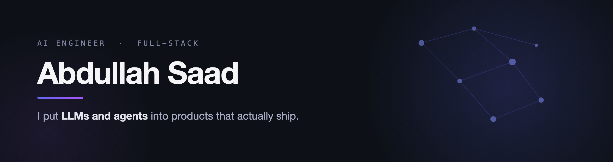

<div align="center">

<picture>
  <source media="(prefers-color-scheme: dark)" srcset="./banner-dark.png">
  <source media="(prefers-color-scheme: light)" srcset="./banner-light.png">
  
</picture>

[Portfolio](https://abdullahsaad5.github.io) &nbsp;·&nbsp; [Writing](https://dev.to/abdullahsaad5) &nbsp;·&nbsp; [Medium](https://medium.com/@abdullahsaad5) &nbsp;·&nbsp; [Hashnode](https://abdullahsaad5.hashnode.dev) &nbsp;·&nbsp; [LinkedIn](https://linkedin.com/in/abdullahsaad5)

</div>

---

Most "AI in an app" stops at a chat box. The work I care about is everything after that: an agent that takes real actions on real accounts, plans before it touches anything, knows which client it is acting for, and stops when it is unsure. I build the full stack around that, TypeScript and Next on the front, Node and Python behind it, and I spend most of my time on the unglamorous reliability that decides whether any of it survives production.

Before the AI work I shipped hard full-stack product: car financing with real loan and payment flows, a multi-actor dealership platform, an ERP and storefront for custom PCs. The overlap, someone who ships real product and also builds with agents, is the thing I am leaning into.

## Writing

Putting AI agents into production. The engineering is real, the employer internals stay out of it.

- **[My agent kept reading data it wasn't allowed to. The prompt was never going to stop it.](https://dev.to/abdullahsaad5/my-agent-kept-reading-data-it-wasnt-allowed-to-the-prompt-was-never-going-to-stop-it-564k)** &nbsp;·&nbsp; An AI agent with real API keys read data it shouldn't. Why the prompt is not an access boundary, and the mock-key design that put enforcement below the model.
- **[I'm shipping the best work of my career. None of it feels like mine.](https://dev.to/abdullahsaad5/im-shipping-the-best-work-of-my-career-none-of-it-feels-like-mine-4ehn)** &nbsp;·&nbsp; AI made me faster and the work better, and somewhere in there it stopped feeling like mine. The honest trade underneath that.
- **[I built an abstraction so my agent could write documents. Then I deleted it.](https://dev.to/abdullahsaad5/i-built-an-abstraction-so-my-agent-could-write-documents-then-i-deleted-it-5687)** &nbsp;·&nbsp; A wrapper let the agent write a deck in five lines, and made every deck look the same. Why the constraint, not the abstraction, made the work good.
- **[The hard part of my AI agent wasn't doing the work, it was planning it](https://dev.to/abdullahsaad5/the-hard-part-of-my-ai-agent-wasnt-doing-the-work-it-was-planning-it-n0k)** &nbsp;·&nbsp; Plan mode: an agent that shows you every step, and which account each one touches, before it runs anything.
- **[Why my AI agent kept writing to the wrong client's Salesforce](https://dev.to/abdullahsaad5/why-my-ai-agent-kept-writing-to-the-wrong-clients-salesforce-3aan)** &nbsp;·&nbsp; Identity, and the wrong-account problem when one agent serves many clients.

More on [dev.to](https://dev.to/abdullahsaad5), [Medium](https://medium.com/@abdullahsaad5), and [Hashnode](https://abdullahsaad5.hashnode.dev).

## Building

- **AI agents that operate real apps** &nbsp;·&nbsp; Natural-language action-selection across hundreds of integrations, plan-and-execute with safety gates, reliable document generation. The subject of most of the writing above.
- **Carflys** &nbsp;·&nbsp; Online car financing on MERN and Next: loan processing, credit scoring, payment-gateway integration.
- **CLMS** &nbsp;·&nbsp; A dealership management platform: CRM, inventory, sales analytics, and role-based access across locations.
- **QR Exchange** &nbsp;·&nbsp; Encrypted real-time messaging over QR codes, AES with binary optimization, built in Flutter.

## Stack

[](https://abdullahsaad5.github.io)

## Where the hours go

Measured, not guessed. Live from WakaTime.

<!--START_SECTION:waka-->

```txt
From: 24 August 2022 - To: 28 June 2026

Total Time: 4,793 hrs

JavaScript                 1,821 hrs 24 mins     ⣿⣿⣿⣿⣿⣿⣿⣿⣿⣦⣀⣀⣀⣀⣀⣀⣀⣀⣀⣀⣀⣀⣀⣀⣀   38.00 %
TypeScript                 1,703 hrs 18 mins     ⣿⣿⣿⣿⣿⣿⣿⣿⣷⣀⣀⣀⣀⣀⣀⣀⣀⣀⣀⣀⣀⣀⣀⣀⣀   35.54 %
Dart                       669 hrs 12 mins       ⣿⣿⣿⣦⣀⣀⣀⣀⣀⣀⣀⣀⣀⣀⣀⣀⣀⣀⣀⣀⣀⣀⣀⣀⣀   13.96 %
Other                      101 hrs 29 mins       ⣦⣀⣀⣀⣀⣀⣀⣀⣀⣀⣀⣀⣀⣀⣀⣀⣀⣀⣀⣀⣀⣀⣀⣀⣀   02.12 %
Markdown                   82 hrs 20 mins        ⣦⣀⣀⣀⣀⣀⣀⣀⣀⣀⣀⣀⣀⣀⣀⣀⣀⣀⣀⣀⣀⣀⣀⣀⣀   01.72 %
```

<!--END_SECTION:waka-->

---

<div align="center">

*Off the clock, I'll gladly spend a day deleting code I spent a week writing.*

[](https://linkedin.com/in/abdullahsaad5)
[](https://dev.to/abdullahsaad5)
[](https://medium.com/@abdullahsaad5)
[](https://abdullahsaad5.hashnode.dev)
[](https://abdullahsaad5.github.io)
[](mailto:syedabdullahsaad1@gmail.com)

</div>
